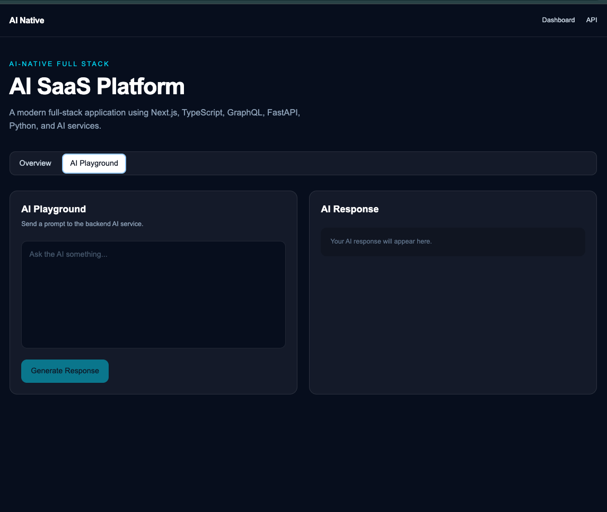

# AI-Native Full-Stack Platform

A production-oriented AI SaaS platform built to demonstrate modern full-stack development with Python, GraphQL, TypeScript, Azure, CI/CD, and AI-assisted software engineering workflows.

The project is designed around a scalable architecture where the frontend, backend, AI services, data layer, and cloud infrastructure can evolve independently while maintaining a consistent developer experience.

## Tech Stack

### Frontend

- TypeScript
- React
- Next.js
- GraphQL
- Responsive, component-driven UI

### Backend

- Python
- FastAPI
- GraphQL
- REST APIs where appropriate
- Async application architecture
- Structured data validation

### AI

- LLM API integrations
- AI-powered application workflows
- Prompt-based orchestration
- Structured AI responses
- AI-assisted development workflows

### Cloud & Infrastructure

- Microsoft Azure
- Azure Container Apps
- Azure Storage
- Azure networking
- Docker
- Environment-based configuration

### CI/CD & Engineering

- GitHub Actions
- Automated testing
- Linting and type checking
- Build and deployment pipelines
- Pull-request based development
- Dependency and security maintenance

## Demo



## Architecture

```text
┌─────────────────────┐
│   Next.js Frontend  │
│     React + TS      │
└──────────┬──────────┘
           │
        GraphQL
           │
┌──────────▼──────────┐
│   Python Backend    │
│ FastAPI + GraphQL   │
└───────┬───────┬─────┘
        │       │
        │       └──────────────┐
        │                      │
┌───────▼────────┐   ┌─────────▼────────┐
│   Data Layer   │   │   AI Services    │
│ DB / Storage   │   │ LLM Integration  │
└────────────────┘   └──────────────────┘
                │
        ┌───────▼────────┐
        │     Azure      │
        │ Cloud Services │
        └────────────────┘